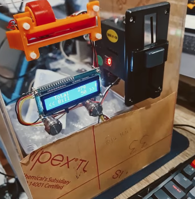
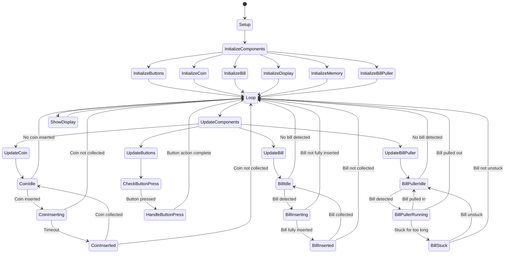
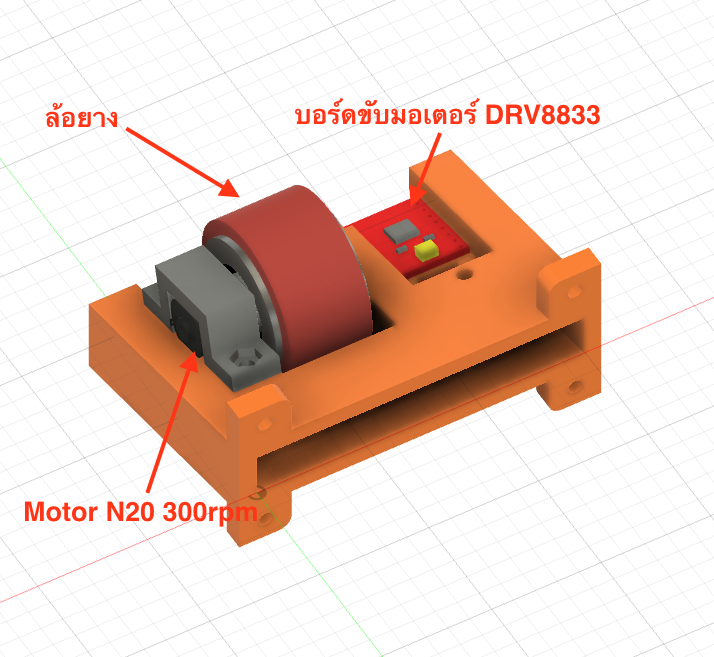
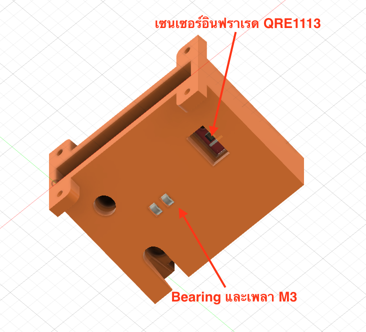
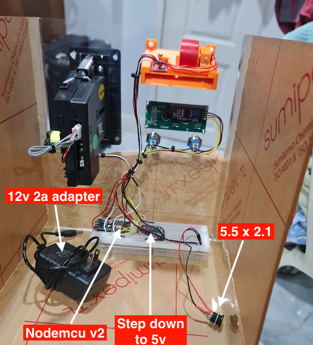
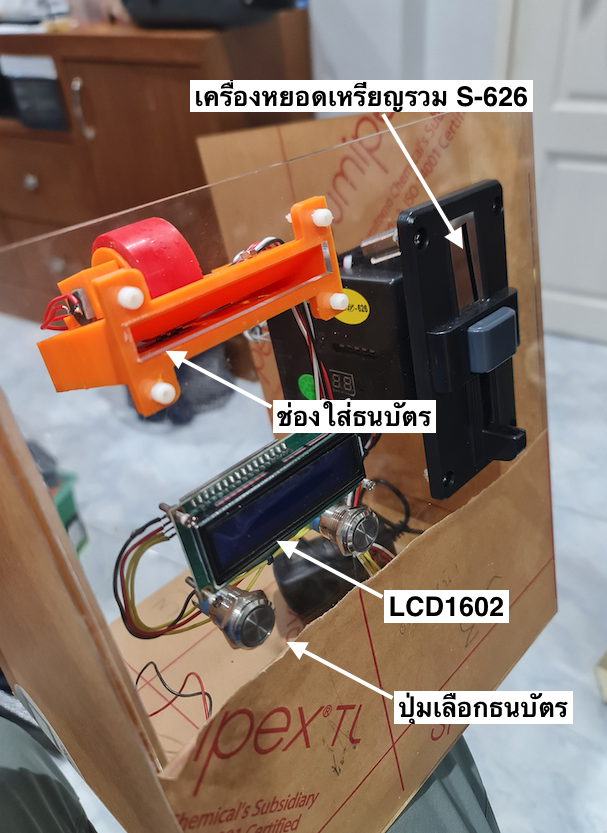

<div align="center" id="top">  
   
</div>

<h1 align="center">SimpleSaving</h1>
 

<!-- Status -->
<!-- 
<h4 align="center"> 
	🚧  SimpleSaving 🚀 Under construction...  🚧
</h4>  -->

<hr> 

<p align="center">
  <a href="#descrypt">คำอธิบาย</a> &#xa0; | &#xa0; 
  <a href="#money">ประเภทเงินที่รองรับ</a> &#xa0; | &#xa0;
  <a href="#principle">หลักการทำงาน</a> &#xa0; | &#xa0;
  <a href="#requirement">อุปกรณ์ที่ใช้</a> &#xa0; | &#xa0; 
  <a href="#wiring">การต่อวงจร</a> &#xa0; | &#xa0; 
  <a href="#library">Library</a> &#xa0; | &#xa0;
  <a href="#problem">ปัญหาเบื้องต้น</a> &#xa0;  
</p>

<br>

<p id="descrypt"></p>

## :moneybag: คำอธิบาย ##

กระปุกออมสินแบบนับเงินทุกครั้งที่มีการออมเข้ามา โดยมูลค่าที่สะสมไว้จะถูกเก็บไว้ใน Local Storage ของเครื่อง ทำให้สามารถดูยอดเงินที่สะสมไว้ได้แม้ไฟตก

<p id="money"></p>

## :dollar: ประเภทเงินที่รองรับ ##

:heavy_check_mark: รองรับธนบัตร 20, 50, 100, 500, 1000\
:heavy_check_mark: รองรับเหรียญ 1, 2, 5, 10

<p id="principle"></p>

## :gear: หลักการทำงาน ## 

เมื่อเครื่องถูกเปิดขึ้นมา ระบบจะดึงค่ายอดเงินที่เครื่องเคยออมไว้มาแสดงผลก่อน หากยังไม่เคยออมเลยจะแสดงผลเป็น 0

เมื่อมีการใส่เหรียญ ระบบจะทำการอ่านค่าเหรียญที่ใส่เข้ามา โดยตัว S-626 จะส่งสัญญาณ LOW-HIGH ออกมาสำหรับเหรียญแต่ละแบบ โดยมีสูงสุด 4 แบบ คือ

| เหรียญ | สัญญาณ |
| --- | --- |
| 1 | 1 ครั้ง |
| 2 | 2 ครั้ง |
| 5 | 3 ครั้ง |
| 10 | 4 ครั้ง |

[สามารถดูวิธีตั้งค่า S-626 ที่นี่](https://youtu.be/M0UGFfYjF38)

โดยระบบจะทำการนับจำนวนครั้งที่ได้รับสัญญาณ และแปลงเป็นจำนวนเงิน แล้วทำการเพิ่มยอดเงินใน Local Storage เพื่อทำการแสดงผลยอดเงินที่สะสมไว้ในเครื่อง

แต่สำหรับในธนบัตร ผู้ใช้ต้องเลือกว่าจะใส่แบงค์มูลค่าเท่าไรก่อนใส่ลงไป โดยสามารถใส่ลงไปได้เรื่อย ๆ ในประเภทธนบัตรเดียวกัน

กรณีที่มีการนำเงินออกทั้งหมด ผู้ใช้สามารถกดปุ่มซ้ายพร้อมกับปุ่มขวา เพื่อทำการล้างยอดเงินที่สะสมไว้ในเครื่อง

### Diagram ###


<p id="requirement"></p>

## :wrench: อุปกรณ์ที่ใช้ ##

ในโปรเจคนี้เขียนโดยใช้ class ของ C++ ในแบบที่ port ไปใช้กับไมโครคอนโทรลเลอร์อื่นได้ง่าย
แต่สำหรับโปรเจคนี้ จะสร้างโดยอิงอุปกรณ์ดังนี้

1. ESP8266 NodeMCU v2
2. จอ LCD 16x2 แบบ I2C
3. ปุ่มกดติดปล่อยดับ 2 ตัว
4. ชุดหยอดเหรียญรวม S-626 
5. breadboard ขนาด 400 ช่อง
6. step down converter to 5v
7. สายไฟแข็ง 1 core สีดำ สีแดง สีขาว สีเหลือง
8. jack 5.5x2.1mm ตัวเมีย
9. Power supply 12v 2a แบบแจ็ค 5.5x2.1mm
10. สาย USB แบบ micro
11. เซนเซอร์อินฟราเรด QRE1113 
12. ล้อยางสิริโคน
13. บอร์ดขับมอเตอร์ DRV8833
14. มอเตอร์ N20 6v 300rpm
15. bearing M3
16. เพลา M3
17. 3d print สำหรับช่องหยอดธนบัตร
18. 3d print สำหรับตัวยึดมอเตอร์
19. กล่องอคริลิคขนาด 25x25x30 cm
20. น็อต M3 และสกรู M3 สำหรับยึดอุปกรณ์เข้ากับกล่อง
<div align="center" > 
   
   
   
   
</div>
<p id="wiring"></p>

## :electric_plug: การต่อวงจร ##


### 1. การต่อจอ LCD ###

| LCD | ESP8266 |
| --- | --- |
| GND | GND |
| VCC | 5V |
| SDA | D2 |
| SCL | D1 |

 
### 2. การต่อปุ่มกด ###

| Left Button | ESP8266 |
| --- | --- |
| NO | GND | 
| COM | D4 | 

| Right Button | ESP8266 |
| --- | --- |
| NO | GND |
| COM | D6 |


### 3. การต่อเซนเซอร์อินฟราเรด ###

| QRE1113 | ESP8266 |
| --- | --- |
| VCC | 3.3V |
| GND | GND |
| OUT | A0 |

### 4. การต่อชุดหยอดเหรียญ ###

| S-626 | ESP8266 |
| --- | --- |
| VCC | 12V |
| GND | GND |
| COIN | D5 |

### 5. การต่อบอร์ดขับมอเตอร์ DRV8833 ###

| DRV8833 | ESP8266 | Step Down |
| --- | --- | --- |
| VM |  | OUT+ |
| GND | GND | GND |
| AIN1 | D7 | |
| AIN2 | GND | |
| STBY | | OUT+ |

### 6. การต่อ step down converter ###

| Step Down | Power adapter 12v | ESP8266 |
| --- | --- | ---|
| IN+ | 12V | |
| IN- | GND | |
| OUT+ | | VIN |
| OUT- | | GND |

### 7. การต่อมอเตอร์ ###

| Motor | DRV8833 |
| --- | --- |
| + | AOUT1 |
| - | AOUT2 |


โดยข้อมูลขาสัญญาณของ ESP8266 สามารถดูได้จากในโค้ดส่วนนี้

```cpp
/* --------------------------------- Pinout --------------------------------- */
pin_t _pin_lcd_sda(4, OUTPUT);         //D2 on Nodemcu v2
pin_t _pin_lcd_scl(5, OUTPUT);         //D1 on Nodemcu v2 
pin_t _pin_coin(14, INPUT_PULLUP);     //D5 on Nodemcu v2
pin_t _pin_bill(A0, INPUT);            //ADC0 on Nodemcu v2
pin_t _pin_puller(15, OUTPUT);         //D8 on Nodemcu v2 
pin_t _pin_bleft(2, INPUT_PULLUP);     //D4 on Nodemcu v2 *** HIGH At boot
pin_t _pin_bright(12, INPUT_PULLUP);   //D6 on Nodemcu v2
```

<p id="library">

## :books: Library ##

- [LiquidCrystal_I2C](https://github.com/enjoyneering/LiquidCrystal_I2C) - ใช้สำหรับเชื่อมต่อกับจอ LCD แบบ I2C 
- [ESP_EEPROM](https://github.com/jwrw/ESP_EEPROM) - ใช้สำหรับเขียนข้อมูลลงใน EEPROM ของ ESP8266 โดยใช้การจำลอง EEPROM ด้วยการเขียนลงใน Flash
- [EncButton](https://github.com/GyverLibs/EncButton) - ใช้สำหรับอ่านค่าปุ่มกด มีระบบ debounce และเรียกใช้การกดได้หลายแบบ

<p id="problem">

## :warning: วิธีแก้ปัญหา ##
- หากเกิดปัญหากระดาษติด จะมีข้อความแสดงว่า Bill stuck ให้เราถอดปลั๊กจากนั้นดึงธนบัตรออกมาแล้วจึงเสียบปลั๊กเข้าไปใหม่ ยอดเงินที่ออมไว้จะไม่หายไป แต่ยธนบัตรที่ติดจะไม่ถูกนับ
 
<a href="#top">Back to top</a>
